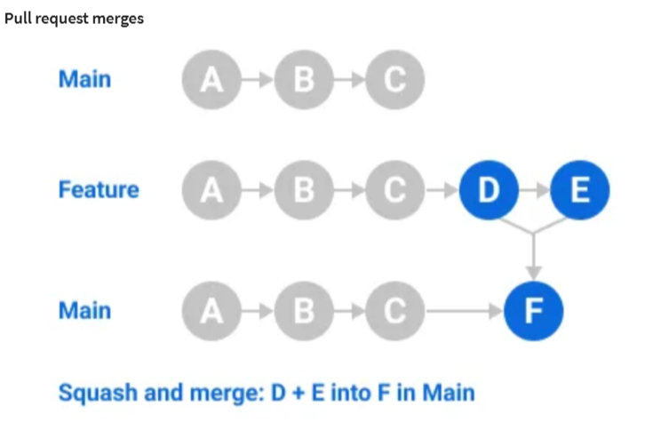

# Study guide: Git forks and pull requests

GitHub is an open-source platform for collaboration and knowledge sharing, allowing users to explore code created by others. This study guide will provide you with pointers on effectively using the platform to make pull requests in the Git environment.

## Pull requests

Pull requests allow you to inform fellow contributors about changes that have been made to a branch in Git. When pulling requests, you can discuss and evaluate proposed changes before implementing changes to the primary branch.

You can eventually merge changes back into the main repository (or repo) by creating a pull request. However, it is important to note that before any changes are made to the original code, GitHub creates a fork (or a copy of the project), which allows changes to be committed to the fork copy even if changes cannot be pushed to the other repo. Anyone can suggest changes through the inline comment in pull requests, but the owner only has rights to review and approve changes before merging them. To create a pull request:

- Make changes to the file.
- Change the proposal and complete a description of the change.
- Click the Proposed File Change button to create a commit in the forked repo to send the change to the owner.
- Enter comments about the change. If more context is needed about the change, use the text box.
- Click Pull Request.

When creating multiple commits, a number next to the pull request serves as the identifier for accessing the pull requests in the future. This is important because it allows project maintainers to follow up with questions or comments.

For more information on creating pull requests, click the following link: [Creating a pull request](https://docs.github.com/en/pull-requests/collaborating-with-pull-requests/proposing-changes-to-your-work-with-pull-requests/creating-a-pull-request).

## Pull request merges

You can merge pull requests by retaining the commits. Below is a list of pull request merge options that you can use when merging pull requests.

- **Merge commits**. All commits from the feature branch are added to the base branch in a merge commit using the --no-ff option.
- **Squash and merge commits**. Multiple commits of a pull request are squashed, or combined into a single commit, using the fast-forward option. It is recommended that when merging two branches, pull requests are squashed and merged to prevent the likelihood of conflicts due to redundancy.
- **Merge message for a squash merge**. GitHub generates a default commit message, which you can edit. This message may include the pull request title, pull request description, or information about the commits.
- **Rebase and merge commits**. All commits from the topic branch are added onto the base branch individually without a merge commit.
- **Indirect merges**. GitHub can merge a pull request automatically if the head branch is directly or indirectly merged into the base branch externally.

## Key takeaways

Pull requests are a crucial tool you can use for efficiently capturing, implementing, and receiving approvals for changes. These capabilities are made possible through collaboration. Practicing pull requests can help you hone your skills and contribute to a project.
