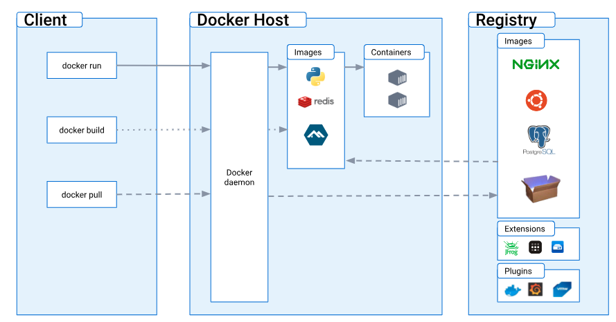
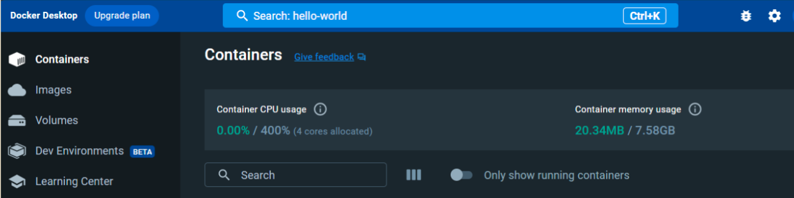
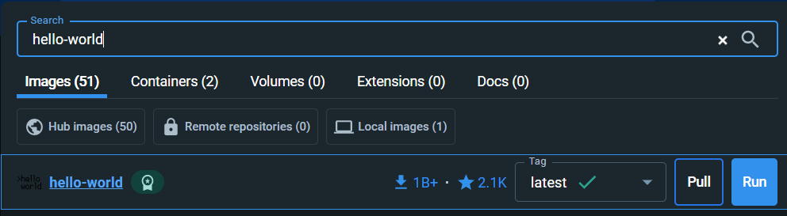

# Set up Docker

Docker is an easy way to package and run applications in containers. Some would consider it the most popular containerized technology. A container is a lightweight, portable, and isolated environment that facilitates the testing and deployment of new software. Within the container, the application is isolated from all other processes on the host machine. In the programming world, there is a saying that goes, “Well, it works on my machine,” meaning that a developer wrote some code that works perfectly on their local machine but does not work on others’ machines. Docker helps solve this common—and annoying—problem by providing a consistent runtime across different environments.

## Parts of Docker 
The Docker ecosystem consists of the following parts:

- `Docker daemon.` This manages running containers on a host machine called the Docker Host.

- `Docker CLI (command-line interface).` This command-line tool interacts with Docker Daemon. 

- `Docker Desktop.` This graphical user interface (GUI) tool interacts with the daemon.

- `Docker Hub.` This is the central repository for downloading containers.

You might hear the host machine referred to as Docker Host. Docker uses a client-server architecture as outlined by the image below. Docker supports running the client tools and daemon on different machines. This is an advantage of Docker as it allows you to manage containers on a remote server as easily as if they’re on your own workstation. 



## Installing Docker 
Before you get started, it is recommended you read the 
Getting started guide in the official Docker documentation. Next, download and install Docker according to your operating system:

- `Windows.` [Install Docker desktop on Windows | Docker documentation](https://docs.docker.com/desktop/setup/install/windows-install/)

- `macOS.` [Install Docker desktop on Mac | Docker documentation](https://docs.docker.com/desktop/setup/install/mac-install/)

- `Linux.` [Install Docker desktop on Linux | Docker documentation](https://docs.docker.com/desktop/setup/install/linux/)

When you complete the installation, you will have the Docker Daemon and Docker Desktop app installed. You are now ready to run your first container. Let’s look at how to do this on the Docker desktop app:

1. Open the Docker desktop app.

2. Select the Search bar at the top of the window.

3. In the search bar, type hello-world and press Enter.

    

1. To the right of the found hello-world container, click Run.

    

1. Docker downloads the image from Docker Hub and runs it. If successful, you will see a congratulatory message:

    ```
    Hello from Docker!
    This message shows that your installation appears to be working correctly.
    ```

    To generate this message, Docker took the following steps:
    1. The Docker client contacted the Docker daemon.
    2. The Docker daemon pulled the "hello-world" image from the Docker Hub (amd64).
    3. The Docker daemon created a new container from that image which runs the executable that produces the output you are currently reading.
    4. The Docker daemon streamed that output to the Docker client, which sent it to your terminal.

    To try something more ambitious, you can run an Ubuntu container with:

    ```
    $ docker run -it ubuntu bash
    ```

    Share images, automate workflows, and more with a free Docker ID:
    ```	
    https://hub.docker.com/
    ```

    For more examples and ideas, visit:
    ```	
    https://docs.docker.com/get-started/
    ```

    And that’s it! Not too bad right? Now let’s do the same thing, but this time from the command line.

    Open a terminal window, type `docker`, and press Enter.

    **Note:** The Docker CLI displays a summary of possible subcommands when the installation is successful.

        Type `docker run hello-world` and press Enter.

    **Note:** Docker displays diagnostic messages about downloading the hello-world image, then the following message if successful:

        ```	
        Hello from Docker!

        This message shows that your installation appears to be working correctly.
        ```

# Troubleshooting

You might run into a situation in which your permissions are denied while trying to connect to the Docker daemon. In this case, run the command again with **sudo**:

```bash
sudo docker run hello-world
```

If that command is successful, check your OS for a Docker group and add yourself to it. This allows you to run Docker commands without being rooted.

The Docker installation should automatically add the Docker CLI to your system path. Unfortunately, that doesn’t always happen. You’ll know that the Docker installation did not add the Docker CLI to your system path if you receive the message: **command not found: docker**. In this case, log out and back in to see if it corrects the issue. If not, consult your OS documentation on how to find the Docker binary and change your system path. For additional help for troubleshooting Docker installation, view the links according to your operating system:

- **Linux**: [Troubleshoot Docker engine installation](https://docs.docker.com/engine/install/linux-postinstall/)
- **Window and Mac**: [Workarounds for common problems](https://docs.docker.com/docker-for-mac/troubleshoot/)

---

## Key takeaways

When you have Docker up and running on your machine, you are in business! Docker provides so many advantages. With Docker, you can package any application and everything it needs into a portable container, and run the container! The best part is you can run the container from almost anywhere; it does not have to be on your own workstation.
