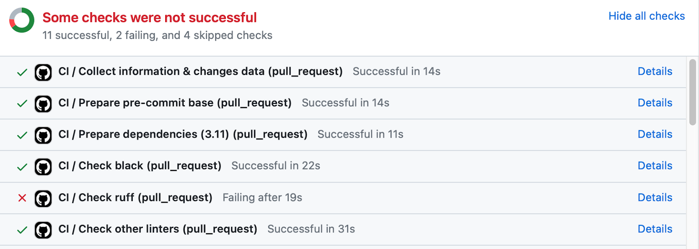

# Integration with Github

GitHub is one of the most important platforms for Continuous Integration (CI) because it is the most popular site for hosting and collaborating code projects.

In order to build your project on GitHub, a CI server needs to fetch your code and other artifacts such as configuration files from source control. The exact details vary depending on the CI system in use, but the basic outline is this:

1. Log into GitHub and go to the [personal access tokens (classic)](https://github.com/settings/tokens) page.

2. From the Generate new token drop-down menu, select Generate new token (classic).

3. Give the token a name and select the permissions your CI system needs (these will usually be listed in the CI system documentation).

4. Click Generate token. Make sure you save the token. It will only be displayed once.

5. Provide your GitHub username and the token to your CI system.

After you have integrated the two, the CI system will watch your GitHub project for new code commits. Usually this means watching for three types of events:

1. Commits to the master branch.

2. Commits to an alternative branch.

3. Pull requests being merged into master or another branch.

These events can trigger the CI system to fetch the latest code and run the CI pipeline in that branch. 

## Webhooks
GitHub is able to notify CI tools about code changes through webhooks. A webhook is a URL provided to GitHub by the CI system. GitHub will send an HTTP request to the webhook URL whenever certain events happen in the GitHub repository (such as the three scenarios outlined above). GitHub will pass certain information in the HTTP request that informs the CI system of the commit.

Usually the CI system will use your GitHub API token to add the webhooks to your GitHub project for you. In some cases, they will provide instructions and a webhook URL that you can paste into GitHub yourself.

## GitHub’s status checks
GitHub’s status checks notify you if your commits meet the conditions set for the repository to which you’re contributing. A status check is a GitHub API feature that allows an external CI system to mark a pipeline as pending, succeeded, or failed. A screenshot below shows a display of status checks: 

A single pipeline may create several status checks in GitHub. For example:

- Build - succeeded

- Unit tests - succeeded

- Integration tests - pending

- Security scan - pending

GitHub will display the status checks on the appropriate commit or branch, so that you can watch the status of the pipeline without having to find it in the CI tool. For an example of what status checks look like, see [About status checks](https://docs.github.com/en/pull-requests/collaborating-with-pull-requests/collaborating-on-repositories-with-code-quality-features/about-status-checks).

## Key takeaways
CI with GitHub benefits developers and the community. After you have integrated with GitHub, the CI system will watch your GitHub project for new code commits. GitHub communicates changes with the CI system through webhooks. You can review the status checks to see if your commits meet the conditions.

## References

- [What is GitHub And How To Use It? [Updated] (simplilearn.com)](https://www.simplilearn.com/tutorials/git-tutorial/what-is-github)

- [A beginner’s guide to CI/CD and automation on GitHub - The GitHub Blog](https://github.blog/developer-skills/github/a-beginners-guide-to-ci-cd-and-automation-on-github/)

- [Creating webhooks - GitHub Docs](https://docs.github.com/en/webhooks/using-webhooks/creating-webhooks)

- [GitHub integration overview - CircleCI](https://circleci.com/docs/github-integration/)

- [How to Setup a GitHub to Jenkins Pipeline with WebHooks – Fullstack with Santosh (santoshk.dev)](https://santoshk.dev/posts/2022/how-to-setup-a-github-to-jenkins-pipeline-with-webhook/)

- [About status checks - GitHub Docs](https://docs.github.com/en/pull-requests/collaborating-with-pull-requests/collaborating-on-repositories-with-code-quality-features/about-status-checks)

- [Enabling GitHub Checks - CircleCI](https://circleci.com/docs/enable-checks/)

